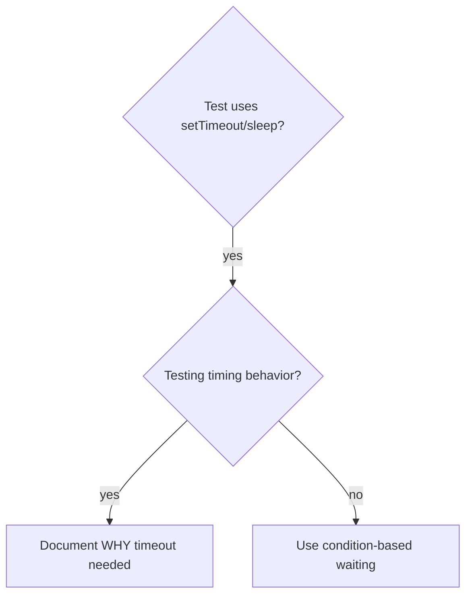

# Condition-Based Waiting

## Overview

Flaky tests often guess at timing with arbitrary delays. This creates race conditions where tests pass on fast machines but fail under load or in CI.

**Core principle:** Wait for the actual condition you care about, not a guess about how long it takes.

## When to Use



**Use when:**

- Tests have arbitrary delays (`setTimeout`, `sleep`, `time.sleep()`)
- Tests are flaky (pass sometimes, fail under load)
- Tests timeout when run in parallel
- Waiting for async operations to complete

**Don't use when:**

- Testing actual timing behavior (debounce, throttle intervals)
- Always document WHY if using arbitrary timeout

## Core Pattern

```typescript
// ❌ BEFORE: Guessing at timing
await new Promise(r => setTimeout(r, 50));
const result = getResult();
expect(result).toBeDefined();

// ✅ AFTER: Waiting for condition
await waitFor('getResult to be defined', () => getResult() !== undefined);
const result = getResult();
expect(result).toBeDefined();
```

## Quick Patterns

| Scenario          | Pattern                                                              |
| ----------------- | -------------------------------------------------------------------- |
| Wait for event    | `waitFor('DONE event', () => events.find(e => e.type === 'DONE'))`   |
| Wait for state    | `waitFor('machine ready', () => machine.state === 'ready')`          |
| Wait for count    | `waitFor('5 items', () => items.length >= 5)`                        |
| Wait for file     | `waitFor('file exists', () => fs.existsSync(path))`                  |
| Complex condition | `waitFor('obj ready with value', () => obj.ready && obj.value > 10)` |

## Implementation

Generic polling function:

```typescript
async function waitFor<T>(
  description: string,
  condition: () => T | undefined | null | false,
  timeoutMs = 5000,
): Promise<T> {
  const startTime = Date.now();

  while (true) {
    const result = condition();
    if (result) return result;

    if (Date.now() - startTime > timeoutMs) {
      throw new Error(
        `Timeout waiting for ${description} after ${timeoutMs}ms`,
      );
    }

    await new Promise((r) => setTimeout(r, 10)); // Poll every 10ms
  }
}
```

## Angular-Specific Waiting Patterns

### `fakeAsync` / `tick` (preferred for synchronous-style async)

Use when testing debounced input, timers, or any time-based behavior:

```typescript
import { fakeAsync, tick } from '@angular/core/testing';

it('should debounce search input', fakeAsync(() => {
  const fixture = TestBed.createComponent(SearchComponent);
  fixture.detectChanges();

  const input = fixture.debugElement.query(By.css('input'));
  input.nativeElement.value = 'search term';
  input.nativeElement.dispatchEvent(new Event('input'));

  // No results yet — debounce hasn't fired
  expect(component.results().length).toBe(0);

  tick(300); // Advance past debounce time
  fixture.detectChanges();

  expect(component.results().length).toBeGreaterThan(0);
}));
```

### Harness Async (preferred for component interaction)

Harness methods internally handle zone stabilization — just `await` them:

```typescript
it('should filter results after typing', async () => {
  const { fixture, harness } = await setupTest();

  await harness.enterSearchText('angular');

  // Harness handles waiting for zone to stabilize
  const results = await harness.getResults();
  expect(results.length).toBeGreaterThan(0);
});
```

### When to Use Which

| Scenario                      | Pattern                                                     |
| ----------------------------- | ----------------------------------------------------------- |
| Testing debounced input       | `fakeAsync` + `tick(debounceTime)`                          |
| Testing component interaction | Harness async (`await harness.method()`)                    |
| Testing HTTP response         | `fakeAsync` + `tick()` with `HttpTestingController.flush()` |
| Testing animation completion  | `fakeAsync` + `tick(animationDuration)`                     |
| Testing interval/timer        | `fakeAsync` + `tick(intervalTime)`                          |
| Waiting for overlay to appear | `await rootLoader.getHarness(SkyModalHarness)`              |

## Common Mistakes

**❌ Polling too fast:** `setTimeout(check, 1)` — wastes CPU
**✅ Fix:** Poll every 10ms

**❌ No timeout:** Loop forever if condition never met
**✅ Fix:** Always include timeout with clear error

**❌ Stale data:** Cache state before loop
**✅ Fix:** Call getter inside loop for fresh data

**❌ `setTimeout` in Angular test:** Arbitrary delays are flaky
**✅ Fix:** Use `fakeAsync`/`tick` or harness async patterns

## When Arbitrary Timeout IS Correct

```typescript
// Tool ticks every 100ms — need 2 ticks to verify partial output
await waitForEvent(manager, 'TOOL_STARTED'); // First: wait for condition
await new Promise((r) => setTimeout(r, 200)); // Then: wait for timed behavior
// 200ms = 2 ticks at 100ms intervals — documented and justified
```

**Requirements:**

1. First wait for triggering condition
2. Based on known timing (not guessing)
3. Comment explaining WHY

## Real-World Impact

From debugging session:

- Fixed 15 flaky tests across 3 files
- Pass rate: 60% → 100%
- Execution time: 40% faster
- No more race conditions
