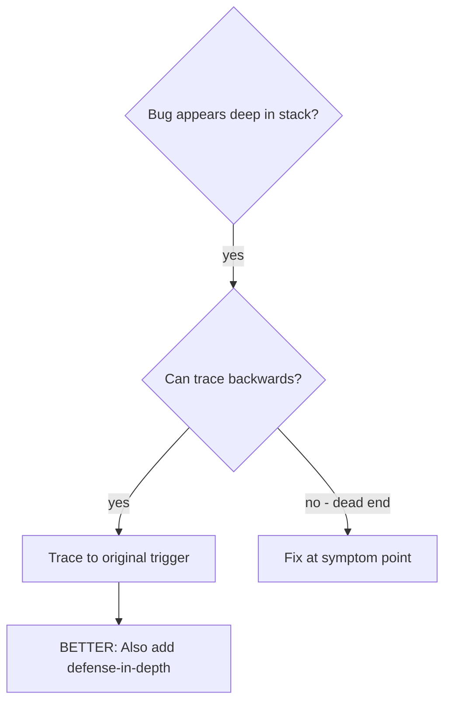
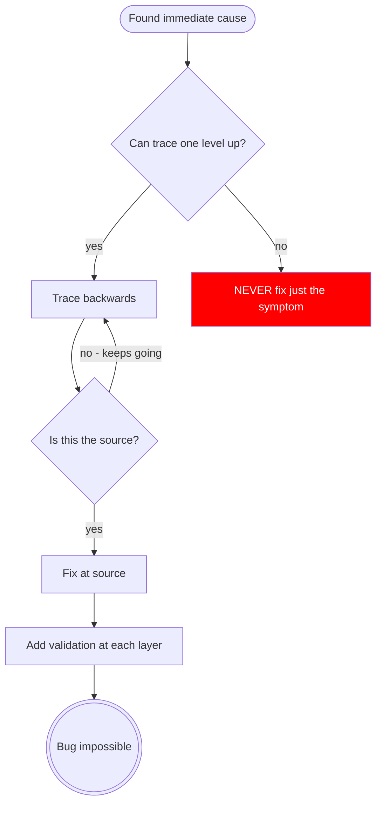

# Root Cause Tracing

## Overview

Bugs often manifest deep in the call stack (wrong provider injected, stale data in a template, overlay rendered but invisible). Your instinct is to fix where the error appears, but that's treating a symptom.

**Core principle:** Trace backward through the call chain until you find the original trigger, then fix at the source.

## When to Use



**Use when:**

- Error happens deep in execution (not at entry point)
- Stack trace shows long call chain
- Unclear where invalid data originated
- Need to find which test/code triggers the problem

## The Tracing Process

### 1. Observe the Symptom

```terminaloutput
NullInjectorError: No provider for SkyModalService!
```

### 2. Find Immediate Cause

**What code directly causes this?**

```typescript
// SkyModalService is injected in the component constructor
constructor(private modalService: SkyModalService) {}
```

### 3. Ask: What Called This?

```typescript
TestBed.createComponent(MyPageComponent)
  → Angular resolves DI for MyPageComponent
  → MyPageComponent injects SkyModalService
  → SkyModalService not in the test's provider tree
```

### 4. Keep Tracing Up

**Why isn't it in the provider tree?**

- `SkyModalService` is `providedIn: 'root'` — so it should be available
- But the test uses `TestBed.configureTestingModule` which creates a fresh injector
- The test imports `MyPageComponent` but not the module that provides the modal infrastructure

### 5. Find Original Trigger

**What's missing from the test setup?**

```typescript
// Test imports the component but not the testing module
TestBed.configureTestingModule({
  imports: [MyPageComponent], // Missing: SkyModalTestingModule
});
```

## Adding Diagnostic Instrumentation

When you can't trace manually, add temporary logging:

```typescript
// Before the problematic operation in the service
openModal(component: Type<unknown>, config: SkyModalConfigurationInterface): void {
  console.error('DEBUG openModal:', {
    component: component.name,
    config,
    providers: config?.providers?.map(p => (p as any).provide?.name),
    stack: new Error().stack,
  });

  this.modalService.open(component, config);
}
```

**Critical:** Use `console.error()` in tests (not a logger service — it may be mocked or suppressed)

**Run and capture:**

```bash
npx ng t --include="path/to/failing.spec.ts" 2>&1 | grep 'DEBUG openModal'
```

**Analyze the output:**

- Which test triggered the call?
- What config was passed?
- Were the expected providers present?

## Finding Which Test Causes Pollution

When a test passes in isolation but fails when run with the full suite, another test is corrupting shared state (e.g., monkey-patching `TestBed`, mutating a singleton service, leaving DOM nodes behind).

**The bisection technique:**

1. Identify the **victim** — the test that fails when run with others but passes alone:

   ```bash
   npx ng t --include="path/to/victim.spec.ts"   # passes alone
   npx ng t                                        # fails in full suite
   ```

2. Isolate candidates — run the victim after each individual spec file to find which one corrupts shared state:

   ```bash
   # Run suspect followed by victim
   npx ng t --include="path/to/suspect.spec.ts,path/to/victim.spec.ts"
   ```

3. Narrow the search — if the suite is large, bisect by directory:
   - Run the victim after the first half of the suite
   - If it fails, the polluter is in that half; if it passes, check the other half
   - Keep halving until you find the single polluting spec file

**Common Angular pollution patterns:**

- A test calls `TestBed.overrideProvider()` or `TestBed.overrideComponent()` without resetting
- A `beforeAll` modifies a `providedIn: 'root'` service that persists across describes
- A test adds DOM elements (overlays, modals) to `document.body` and doesn't clean up in `afterEach`
- A test patches a prototype method (`spyOn` on a shared class) without restoring it

## Real Example: Modal Not Found in Test

**Symptom:** `Error: Expected exactly one match for SkyModalHarness, but found 0.`

**Trace chain:**

1. `loader.getHarness(SkyModalHarness)` finds nothing
2. The modal IS open — `fixture.componentInstance.isModalOpen` is `true`
3. Modal renders in document root, outside the component's DOM tree
4. `TestbedHarnessEnvironment.loader(fixture)` only searches within the component
5. Test setup used `loader(fixture)` instead of `documentRootLoader(fixture)`

**Root cause:** Wrong harness loader scope for overlay components

**Fix:** Changed to `TestbedHarnessEnvironment.documentRootLoader(fixture)`

**Also added defense-in-depth:**

- Layer 1: Test helper function `setupOverlayTest()` that always uses `documentRootLoader`
- Layer 2: Comment in shared test utilities explaining when to use which loader
- Layer 3: Linter rule flagging `loader(fixture)` followed by `getHarness(SkyModalHarness)`

## Key Principle



**NEVER fix just where the error appears.** Trace back to find the original trigger.

## Diagnostic Tips

**In tests:** Use `console.error()` not a logger service — it may be mocked or suppressed
**Before the operation:** Log before the failing call, not in the catch block
**Include context:** Component name, input values, provider configuration, `new Error().stack`
**Angular-specific:** Log `TestBed` provider state with `TestBed.inject()` to verify what's actually registered
