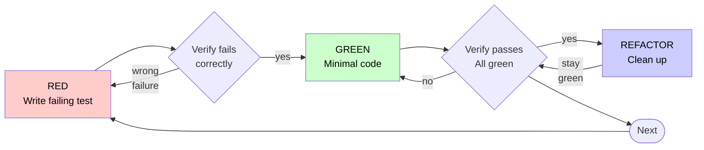

# Test-Driven Development (TDD) for Angular / SKY UX

## Overview

Write the test first. Watch it fail. Write minimal code to pass.

All examples use Angular TestBed, SKY UX component harnesses, and Jasmine. Prefer component harnesses over direct DOM queries — harnesses are the stable testing API.

**Core principle:** If you didn't watch the test fail, you don't know if it tests the right thing.

**Violating the letter of the rules is violating the spirit of the rules.**

## When to Use

**Always:**

- New features
- Bug fixes
- Refactoring
- Behavior changes

**Exceptions (ask your human partner):**

- Throwaway prototypes
- Generated code
- Configuration files

Thinking "skip TDD just this once"? Stop. That's rationalization.

## The Iron Law

```text
NO PRODUCTION CODE WITHOUT A FAILING TEST FIRST
```

Write code before the test? Delete it. Start over.

**No exceptions:**

- Don't keep it as "reference"
- Don't "adapt" it while writing tests
- Don't look at it
- Delete means delete

Implement fresh from tests. Period.

## Red-Green-Refactor



### RED - Write Failing Test

Write one minimal test showing what should happen.

<Good>
```typescript
it('should display the specified initials when no image is set', async () => {
  const { fixture, harness } = await setupTest();

fixture.componentRef.setInput('name', 'Jane Doe');

await expectAsync(harness.getInitials()).toBeResolvedTo('JD');
});

````
Clear name, tests real behavior via harness, one thing
</Good>

<Bad>
```typescript
it('should work', async () => {
  const fixture = TestBed.createComponent(AvatarComponent);
  fixture.detectChanges();
  const el = fixture.debugElement.query(By.css('.sky-avatar-initials-inner'));
  expect(el.nativeElement.textContent.trim()).toBe('JD');
});
````

Vague name, queries internal DOM classes, skips harness
</Bad>

**Requirements:**

- One behavior
- Clear name
- Real code via harness (no DOM queries unless unavoidable)

### Verify RED - Watch It Fail

**MANDATORY. Never skip.**

```bash
npx jest path/to/component.spec.ts
```

Confirm:

- Test fails (not errors)
- Failure message is expected
- Fails because feature missing (not typos)

**Test passes?** You're testing existing behavior. Fix test.

**Test errors?** Fix error, re-run until it fails correctly.

### GREEN - Minimal Code

Write simplest code to pass the test.

<Good>
```typescript
@Component({
  selector: 'sky-avatar',
  template: `
    <div class="sky-avatar-initials">
      {{ initials() }}
    </div>
  `,
})
export class AvatarComponent {
  public name = input<string>();

protected initials = computed(() => {
const name = this.name();
if (!name) return undefined;
return name.split(' ').map(n => n[0]).join('').toUpperCase();
});
}

````
Just enough to pass
</Good>

<Bad>
```typescript
@Component({
  selector: 'sky-avatar',
  template: `...`,
})
export class AvatarComponent {
  public name = input<string>();
  public size = input<AvatarSize>('medium');
  public src = input<string | Blob>();
  public canChange = input(false);
  // YAGNI - test only asked for initials
}
````

Over-engineered beyond what the test requires
</Bad>

Don't add features, refactor other code, or "improve" beyond the test.

### Verify GREEN - Watch It Pass

**MANDATORY.**

```bash
npx jest path/to/component.spec.ts
```

Confirm:

- Test passes
- Other tests still pass
- Output pristine (no errors, warnings)

**Test fails?** Fix code, not test.

**Other tests fail?** Fix now.

### REFACTOR - Clean Up

After green only:

- Remove duplication
- Improve names
- Extract helpers

Keep tests green. Don't add behavior.

### Repeat

Next failing test for next feature.

## Good Tests

| Quality           | Good                                           | Bad                                                                   |
| ----------------- | ---------------------------------------------- | --------------------------------------------------------------------- |
| **Minimal**       | One thing. "and" in name? Split it.            | `it('validates email and domain and whitespace')`                     |
| **Clear**         | Name describes behavior                        | `it('test1')`                                                         |
| **Shows intent**  | Demonstrates desired API                       | Obscures what code should do                                          |
| **Harness-first** | Uses harness methods (`harness.getInitials()`) | Queries internal CSS classes (`By.css('.sky-avatar-initials-inner')`) |

## Why Order Matters

**"I'll write tests after to verify it works"**

Tests written after code pass immediately. Passing immediately proves nothing:

- Might test wrong thing
- Might test implementation, not behavior
- Might miss edge cases you forgot
- You never saw it catch the bug

Test-first forces you to see the test fail, proving it actually tests something.

**"I already manually tested all the edge cases"**

Manual testing is ad-hoc. You think you tested everything but:

- No record of what you tested
- Can't re-run when code changes
- Easy to forget cases under pressure
- "It worked when I tried it" ≠ comprehensive

Automated tests are systematic. They run the same way every time.

**"Deleting X hours of work is wasteful"**

Sunk cost fallacy. The time is already gone. Your choice now:

- Delete and rewrite with TDD (X more hours, high confidence)
- Keep it and add tests after (30 min, low confidence, likely bugs)

The "waste" is keeping code you can't trust. Working code without real tests is technical debt.

**"TDD is dogmatic, being pragmatic means adapting"**

TDD IS pragmatic:

- Finds bugs before commit (faster than debugging after)
- Prevents regressions (tests catch breaks immediately)
- Documents behavior (tests show how to use code)
- Enables refactoring (change freely, tests catch breaks)

"Pragmatic" shortcuts = debugging in production = slower.

**"Tests after achieve the same goals - it's spirit not ritual"**

No. Tests-after answer "What does this do?" Tests-first answer "What should this do?"

Tests-after are biased by your implementation. You test what you built, not what's required. You verify remembered edge cases, not discovered ones.

Tests-first force edge case discovery before implementing. Tests-after verify you remembered everything (you didn't).

30 minutes of tests after ≠ TDD. You get coverage, lose proof tests work.

## Common Rationalizations

| Excuse                                 | Reality                                                                                                            |
| -------------------------------------- | ------------------------------------------------------------------------------------------------------------------ |
| "Too simple to test"                   | Simple code breaks. Test takes 30 seconds.                                                                         |
| "I'll test after"                      | Tests passing immediately prove nothing.                                                                           |
| "Tests after achieve same goals"       | Tests-after = "what does this do?" Tests-first = "what should this do?"                                            |
| "Already manually tested"              | Ad-hoc ≠ systematic. No record, can't re-run.                                                                      |
| "Deleting X hours is wasteful"         | Sunk cost fallacy. Keeping unverified code is technical debt.                                                      |
| "Keep as reference, write tests first" | You'll adapt it. That's testing after. Delete means delete.                                                        |
| "Need to explore first"                | Fine. Throw away exploration, start with TDD.                                                                      |
| "Test hard = design unclear"           | Listen to test. Hard to test = hard to use.                                                                        |
| "TDD will slow me down"                | TDD faster than debugging. Pragmatic = test-first.                                                                 |
| "Manual test faster"                   | Manual doesn't prove edge cases. You'll re-test every change.                                                      |
| "Existing code has no tests"           | You're improving it. Add tests for existing code.                                                                  |
| "I'll just query the DOM directly"     | Harnesses are the stable API. Internal CSS classes change without notice.                                          |
| "ng-mocks makes setup easier"          | It replaces Angular's real behavior with stubs. You end up testing a fiction. Use real components + jasmine spies. |

## Red Flags - STOP and Start Over

- Code before test
- Test after implementation
- Test passes immediately
- Can't explain why test failed
- Tests added "later"
- Rationalizing "just this once"
- "I already manually tested it"
- "Tests after achieve the same purpose"
- "It's about spirit not ritual"
- "Keep as reference" or "adapt existing code"
- "Already spent X hours, deleting is wasteful"
- "TDD is dogmatic, I'm being pragmatic"
- "This is different because..."
- Querying internal DOM classes when a harness exists
- Importing `ng-mocks` or `MockBuilder`
- Using deprecated `Sky*Fixture` classes instead of `Sky*Harness`
- Using deprecated `Sky*TestingModule` instead of `provide*Testing()` functions

**All of these mean: Delete code. Start over with TDD.**

## Example: Bug Fix

**Bug:** Avatar error modal not dismissable after invalid file upload

**RED**

```typescript
it('should close the error modal after an invalid file is uploaded', async () => {
  const { fixture, harness } = await setupTest();

  fixture.componentRef.setInput('canChange', true);
  fixture.detectChanges();

  await harness.dropAvatarFile(
    new File([], 'test.txt', { type: 'text/plain' }),
  );

  await expectAsync(harness.hasFileTypeError()).toBeResolvedTo(true);

  await harness.closeError();

  await expectAsync(harness.hasFileTypeError()).toBeResolvedTo(false);
});
```

**Verify RED**

```bash
$ npx jest avatar-harness.spec.ts
FAIL: Expected to be resolved to false but was resolved to true.
```

**GREEN**

```typescript
public async closeError(): Promise<void> {
  const errorModal = await this.#errorModal();

  if (!errorModal) {
    throw new Error('No error is currently displayed.');
  }

  await errorModal.clickCloseButton();
}
```

**Verify GREEN**

```bash
$ npx jest avatar-harness.spec.ts
PASS
```

**REFACTOR**
Extract shared error modal assertions if needed.

## Angular Testing Quick Reference

For test setup patterns, component harness usage, overlay testing, mocking strategies, and available SKY UX testing utilities, read [Angular testing patterns for SKY UX](references/angular-testing-patterns.md). It covers:

- TestBed configuration and minimal setup
- Component harness architecture (`SkyComponentHarness`, `data-sky-id`, harness methods)
- Overlay testing with `documentRootLoader`
- SKY UX testing controllers (`SkyModalTestingController`, etc.)
- Accessing child components with `debugElement` (no ng-mocks)
- Mocking strategies and deprecated patterns to avoid

## Verification Checklist

Before marking work complete:

- [ ] Every new function/method has a test
- [ ] Watched each test fail before implementing
- [ ] Each test failed for expected reason (feature missing, not typo)
- [ ] Wrote minimal code to pass each test
- [ ] All tests pass
- [ ] Output pristine (no errors, warnings)
- [ ] Tests use real code (mocks only if unavoidable)
- [ ] Edge cases and errors covered
- [ ] Component harnesses used where available (not direct DOM queries)
- [ ] TestBed imports are minimal (only what the test needs)
- [ ] No deprecated `Sky*Fixture` classes or `Sky*TestingModule` modules
- [ ] Overlay components use `documentRootLoader` not `loader`

Can't check all boxes? You skipped TDD. Start over.

## When Stuck

| Problem                          | Solution                                                                                                                                                                 |
| -------------------------------- | ------------------------------------------------------------------------------------------------------------------------------------------------------------------------ |
| Don't know how to test           | Write wished-for API. Write assertion first. Ask your human partner.                                                                                                     |
| Test too complicated             | Design too complicated. Simplify interface.                                                                                                                              |
| Must mock everything             | Code too coupled. Use dependency injection.                                                                                                                              |
| Test setup huge                  | Extract helpers. Still complex? Simplify design.                                                                                                                         |
| No harness exists                | Check `@skyux/*/testing` packages (e.g., `import { SkyAvatarHarness } from '@skyux/avatar/testing'`). If none, use `fixture.debugElement` with `data-sky-id` attributes. |
| Overlay not found in test        | Use `TestbedHarnessEnvironment.documentRootLoader(fixture)` instead of `.loader(fixture)`.                                                                               |
| Need to test responsive behavior | Use `provideSkyMediaQueryTesting()` to mock media breakpoints.                                                                                                           |

## Debugging Integration

Bug found? Write failing test reproducing it. Follow TDD cycle. Test proves fix and prevents regression.

Never fix bugs without a test. See the [migration-resolver](../migration-resolver/SKILL.md) skill for the full systematic debugging process.

## Testing Anti-Patterns

When adding mocks or test utilities, read [testing antipatterns](references/testing-antipatterns.md) to avoid common pitfalls:

- Testing mock behavior instead of real behavior
- Adding test-only methods to production classes
- Mocking without understanding dependencies
- Using ng-mocks when simple mocks suffice
- Querying internal DOM when harnesses exist

## Final Rule

```
Production code → test exists and failed first
Otherwise → not TDD
```

No exceptions without your human partner's permission.

## Attribution

Based on [superpowers](https://github.com/obra/superpowers) by Jesse Vincent, licensed under [MIT](https://github.com/obra/superpowers/blob/main/LICENSE).
